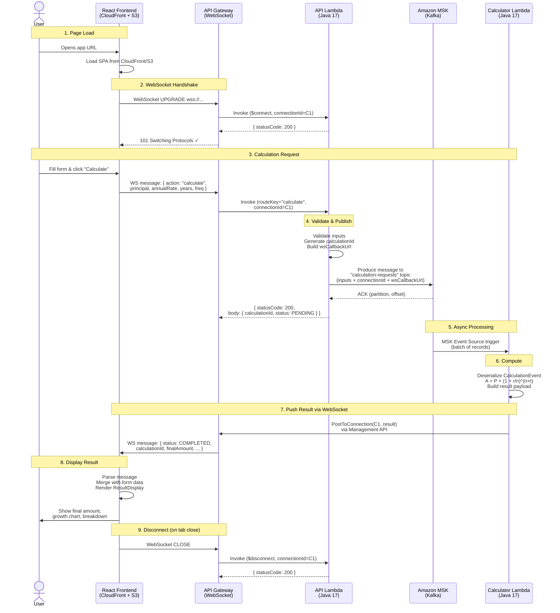

# Request-to-Response Flow: Compound Interest Calculator

## Step-by-Step Walkthrough

### 1. User Opens the App
- Browser loads the React SPA from **CloudFront** (backed by S3).
- On mount, the frontend opens a **WebSocket connection** to `wss://<api-id>.execute-api.us-east-1.amazonaws.com/prod`.

### 2. WebSocket `$connect`
- API Gateway receives the upgrade request and invokes the **API Lambda** with `routeKey: "$connect"`.
- The Lambda logs the connection and returns `{ statusCode: 200 }`.
- API Gateway completes the WebSocket handshake; the client is now connected.
- The frontend stores the `connectionId` implicitly (managed by API Gateway).

### 3. User Submits a Calculation
- The user fills in **principal**, **annualRate**, **years**, and **compoundingFrequency** in the form and clicks "Calculate".
- The frontend sends a WebSocket message:
  ```json
  {
    "action": "calculate",
    "principal": 10000,
    "annualRate": 5.5,
    "years": 10,
    "compoundingFrequency": 12
  }
  ```

### 4. API Lambda Processes the `calculate` Route
- API Gateway matches `action: "calculate"` to the `calculate` route and invokes the **API Lambda**.
- The Lambda:
  1. Extracts `connectionId` and `domainName`/`stage` from `requestContext`.
  2. Parses and validates the request body.
  3. Generates a unique `calculationId` (UUID).
  4. Builds the `wsCallbackUrl` = `https://<domainName>/<stage>`.
  5. Constructs a Kafka event containing all calculation inputs + `connectionId` + `wsCallbackUrl`.
  6. **Publishes the event to Kafka** topic `calculation-requests` via the Kafka producer.
  7. Returns `{ statusCode: 200, body: { calculationId, status: "PENDING" } }`.

### 5. Kafka Delivers the Message
- Amazon **MSK** (Managed Streaming for Apache Kafka) receives the message on topic `calculation-requests`.
- The MSK event source mapping triggers the **Calculator Lambda** with a batch of records.

### 6. Calculator Lambda Computes the Result
- The Lambda:
  1. Deserializes each Kafka record into a `CalculationEvent`.
  2. Extracts `principal`, `annualRate`, `years`, `compoundingFrequency`.
  3. Applies the compound interest formula: **A = P × (1 + r/n)^(n×t)**.
  4. Builds a result payload:
     ```json
     {
       "calculationId": "uuid",
       "status": "COMPLETED",
       "principal": 10000.0,
       "annualRate": 5.5,
       "years": 10,
       "compoundingFrequency": 12,
       "finalAmount": 17310.76,
       "completedAt": 1774922369682
     }
     ```

### 7. Calculator Lambda Pushes Result via WebSocket
- Using the `connectionId` and `wsCallbackUrl` from the Kafka event, the Lambda:
  1. Creates an **API Gateway Management API** client pointing at the callback URL.
  2. Calls `postToConnection(connectionId, resultPayload)`.
  3. The result is pushed directly to the user's browser over the open WebSocket.

### 8. Frontend Displays the Result
- The frontend's `onmessage` handler receives the JSON payload.
- It parses the message, detects `status: "COMPLETED"`.
- Merges the server result with the original form data (via `useRef`).
- Renders the `ResultDisplay` component showing:
  - Input parameters (principal, rate, years, frequency)
  - Final amount
  - Growth chart and year-by-year breakdown

### 9. WebSocket `$disconnect`
- When the user closes the browser tab (or the connection times out), API Gateway sends a `$disconnect` event to the API Lambda.
- The Lambda logs the disconnection and returns `{ statusCode: 200 }`.

---

## Sequence Diagram



---

## Component Summary

| Component | Technology | Role |
|-----------|-----------|------|
| **Frontend** | React + Vite + TailwindCSS | SPA served from CloudFront/S3; WebSocket client |
| **API Gateway** | AWS WebSocket API | Routes `$connect`, `$disconnect`, `calculate`; manages connections |
| **API Lambda** | Java 17, Kafka Producer | Validates input, publishes to Kafka with WS callback info |
| **Amazon MSK** | Apache Kafka 3.5.1 | Decouples request ingestion from computation |
| **Calculator Lambda** | Java 17, MSK Consumer | Computes compound interest, pushes result via WS Management API |
| **CloudFront + S3** | AWS CDN + Object Storage | Serves static frontend assets globally |

## Key Design Decisions

- **Kafka as decoupler**: The API Lambda returns immediately after publishing, keeping WebSocket response times fast. The heavy computation happens asynchronously.
- **WebSocket push (not polling)**: The Calculator Lambda pushes results directly to the client's open connection — no polling, no DynamoDB, no wasted API calls.
- **Stateless Lambdas**: No shared state between Lambdas. The `connectionId` and `wsCallbackUrl` travel through Kafka so the Calculator Lambda knows where to send results.
